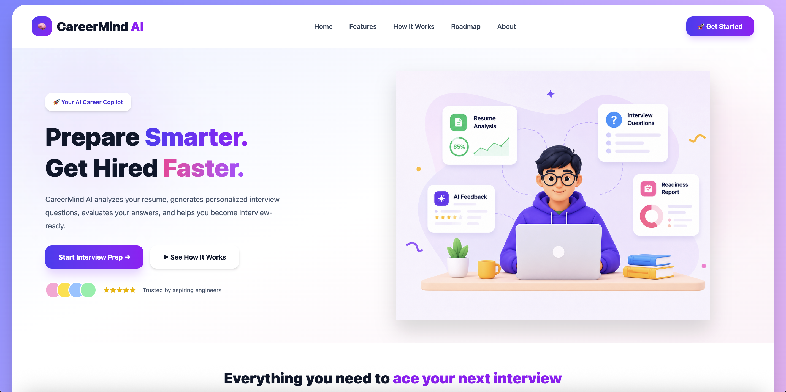
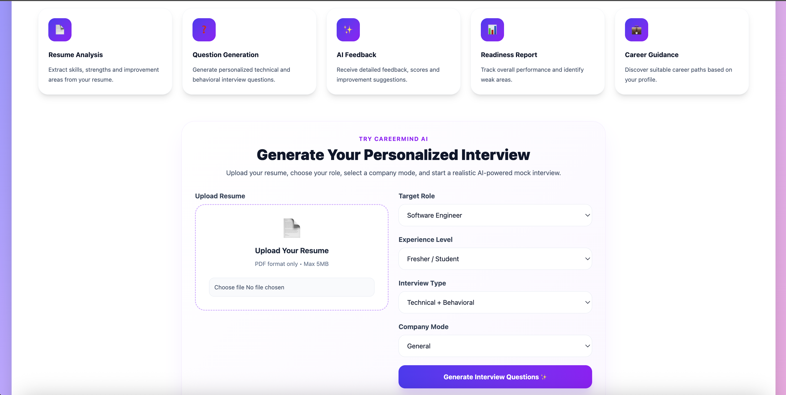
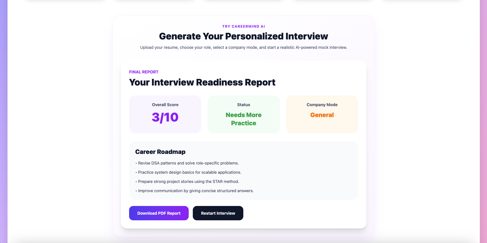

# CareerMind AI

AI-powered interview preparation platform that helps students and job seekers practice interviews, receive feedback, track readiness, and improve interview performance.

## Features

* Resume Upload
* AI-generated Interview Questions
* Mock Interview Practice
* Answer Evaluation
* Readiness Report
* Career Roadmap Recommendations
* Progress Tracking

## Tech Stack

### Frontend

* React.js
* Vite
* CSS

### Backend

* Node.js
* Express.js
* Multer

### AI

* Google Gemini API

## Project Structure

```
CareerMind-AI
├── frontend
│   ├── src
│   ├── public
│   └── package.json
│
├── backend
│   ├── server.js
│   ├── .env
│   └── package.json
```

## Screenshots

### Home Page



### Mock Interview



### Readiness Report



## Installation

### Clone Repository

```bash
git clone https://github.com/krishnatejasai/CareerMind-AI.git
```

### Frontend

```bash
cd frontend
npm install
npm run dev
```

### Backend

```bash
cd backend
npm install
npm run dev
```

### Environment Variables

Create a `.env` file inside backend:

```env
GEMINI_API_KEY=YOUR_API_KEY
PORT=5000
```

## Future Improvements

* Resume Parsing
* ATS Score Analysis
* Voice Interview Support
* FAANG Mode
* Interview Analytics Dashboard
* Multi-role Question Generation

## Author

Sai Sri Krishna Teja Sanku

University of Florida

MS in Computer Science
